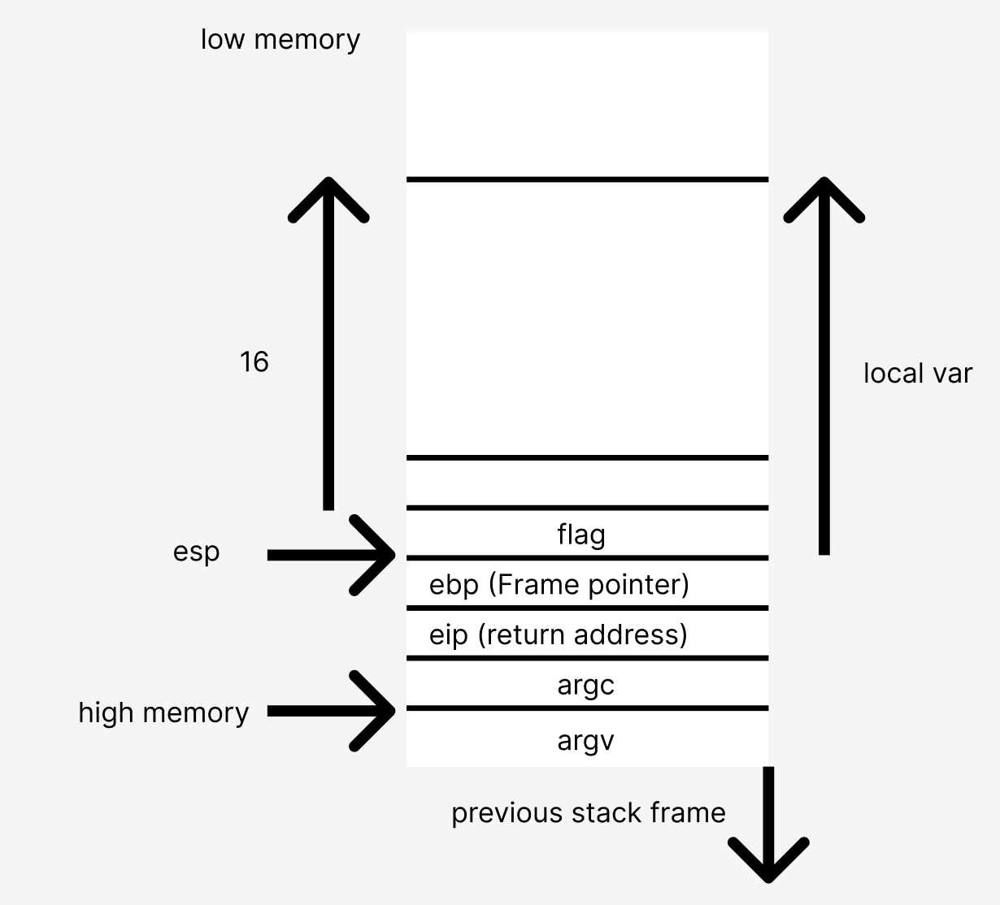
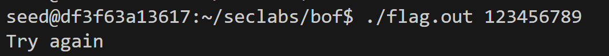
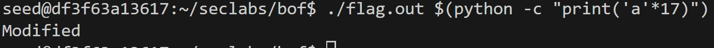

`Lab purpose`: The purpose of this lab is to demonstrate how a buffer overflow can potentially allow attackers to modify the program's execution flow by overwriting adjacent memory locations. In this case, the goal is to manipulate the flag variable, which normally controls the output of the program

`Lab Goal` :The lab  wants  to exploit the buffer overflow vulnerability by providing a command-line argument (i.e., argv[1]) long enough to overwrite the flag variable, thereby changing its value and observing the "Modified" message instead of "Try again".

`Stack Frame` of the program

The strcpy function is vulnerable because it doesn't consider the length of the string being copied. This can lead to a buffer overflow, where extra values overwrite the memory adjacent to the buffer used to store the copied string. In this exercise, to successfully change the value of the flag variable, we need to pass a string (i.e., argv[1]) with more than 16 characters, which will trigger a buffer overflow.

`Steps`
    - Compile the program using the following command: gcc -g flag.c -o flag.out -fno-stack-protector -mpreferred-stack-boundary=2 ( biên dịch chương trình )
    - Run the program with the following command: ./flag.out 123456789 (This command runs the flag.out file and assigns the value of argv[1] = "123456789")
        + In this case, the program will output Try again because argv[1] has 9 characters (less than 16).
        
    - Run the program again with: ./flag.out $(python -c "print('a'*17)") (This command runs the flag.out file and assigns the value of argv[1] to 17 characters of 'a')
        + This time, the program will output Modified because argv[1] contains 17 characters, which causes a buffer overflow.
        